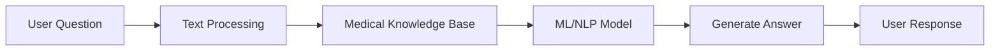
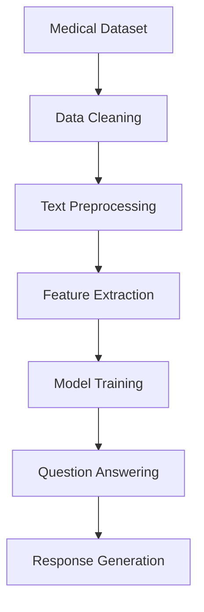

<div align="center">

# 🩺 Medical QA Chatbot


<p align="center">
  
  
  
</p>


</div>

---

## 🚀 Project Overview

Medical QA Chatbot is an intelligent healthcare assistant that answers medical-related questions using Natural Language Processing (NLP) and Machine Learning techniques.

### ✨ Features

- 🧠 AI-Powered Medical Question Answering
- 📚 Knowledge-Based Information Retrieval
- 🔍 Disease & Symptom Information Lookup
- 💬 Interactive Chat Interface
- ⚡ Fast Response Generation
- 📊 Data Processing & Analysis
- 🤖 NLP-Based Understanding

---

## 🎯 Demo Workflow



---

## 🏗️ Project Structure

```bash
medical-qa-chatbot/
│
├── DataSet/
│   └── DATA
│
├── InformationMD_Kaggle.ipynb
│
├── README.md
│
└── requirements.txt
```

---

## 🛠️ Technologies Used

<p align="center">


</p>

| Technology | Purpose |
|------------|---------|
| Python | Core Development |
| Jupyter Notebook | Model Training |
| NLP | Text Understanding |
| Machine Learning | Answer Prediction |
| Pandas | Data Processing |
| NumPy | Numerical Computing |

---

## 📊 Model Pipeline



---

## 📈 Project Progress

```text
Dataset Preparation     ████████████████ 100%
Data Cleaning           ████████████████ 100%
NLP Processing          ██████████████░░ 90%
Model Training          █████████████░░░ 85%
Deployment              ████████░░░░░░░ 50%
```

---

## ⚙️ Installation

### Clone Repository

```bash
git clone https://github.com/ranitghosh26/medical-qa-chatbot.git
cd medical-qa-chatbot
```

### Install Dependencies

```bash
pip install -r requirements.txt
```

### Run Notebook

```bash
jupyter notebook
```

Open:

```bash
InformationMD_Kaggle.ipynb
```

---

## 💡 Example Questions

```text
What are the symptoms of diabetes?
How can I reduce blood pressure?
What causes migraine headaches?
What is the treatment for asthma?
```

---

## 🌟 Future Improvements

- 🔹 Deep Learning Integration
- 🔹 LLM-Based Medical Assistant
- 🔹 Voice Support
- 🔹 Multi-Language Support
- 🔹 Web Deployment
- 🔹 Real-Time Medical Search

---

## ⚠️ Disclaimer

> This chatbot is intended for educational and informational purposes only.
> It should not be used as a substitute for professional medical advice, diagnosis, or treatment.

---

## 🤝 Contributing

Contributions are welcome!

```bash
Fork → Create Branch → Commit → Push → Pull Request
```

---

## 👨‍💻 Author

### Ranit Ghosh

<p align="center">
<a href="https://github.com/ranitghosh26">

</a>
</p>

---

<div align="center">

### ⭐ Star this repository if you found it useful!


</div>
